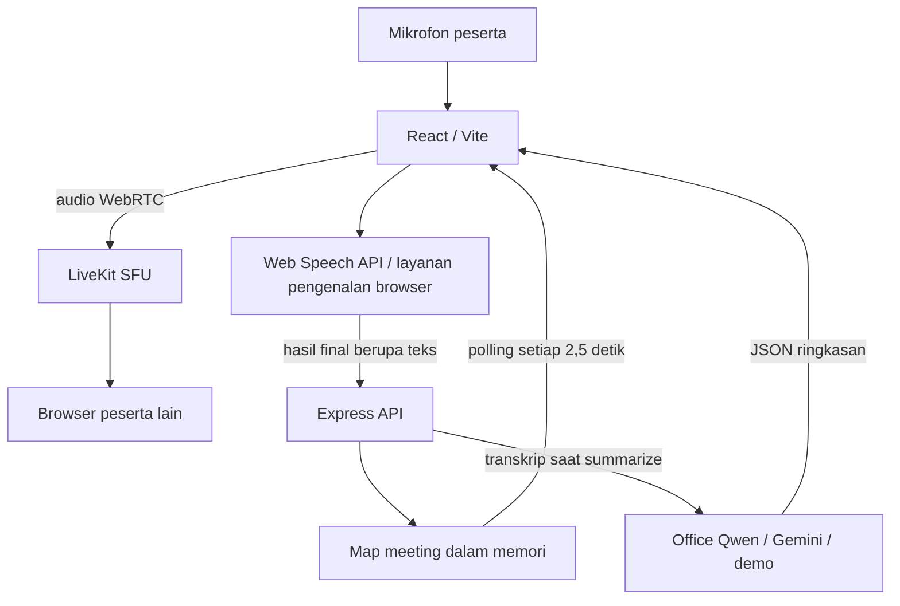

# Pemeriksaan BaliCall — 2 Oktober 2026

> Ini adalah laporan pemeriksaan awal sebelum perbaikan lanjutan. Status terkini, hasil tes, dan batas yang masih tersisa dicatat di [REPAIR_RESULTS.md](REPAIR_RESULTS.md).

Repository: https://github.com/raflishaista/balicall

Commit awal: `0d63cb5bb4a2ed70f0b61063ba27d741ee647c5f`. Perbaikan berada di salinan lokal; belum diunggah ke GitHub.

## Hasil utama

Ada bug kode yang dapat menyebabkan percakapan tidak berubah menjadi teks: efek SpeechRecognition bergantung pada callback yang dibuat ulang setiap render App. Timer panggilan memperbarui App setiap detik, sehingga recognizer dihentikan dan dibuat ulang berulang kali. Ini terbukti dari alur kode; belum dapat dipastikan sebagai satu-satunya penyebab pada komputer pengguna tanpa pengujian mikrofon di lingkungan yang mengalami masalah.

## Arsitektur saat ini

Audio panggilan dan transkripsi adalah dua jalur berbeda. Tidak ada agen backend yang berlangganan audio LiveKit untuk melakukan STT. Setiap peserta mengirim hasil pengenalan mikrofon lokal melalui browsernya sendiri. Office Qwen menerima teks pada endpoint chat completions, bukan audio. Peserta yang browser STT-nya gagal tetap dapat terdengar di panggilan, tetapi ucapannya tidak masuk transkrip.

## Bug yang diperbaiki

| Masalah | Bukti dan perubahan |
|---|---|
| Recognizer dibuat ulang pada render timer/polling | Efek awal bergantung pada `onAddSpeechLine`, callback baru setiap render. Hook baru memakai `useEffectEvent`; pengujian 10 render dengan callback berbeda mempertahankan satu recognizer dan memakai callback terbaru. |
| Restart otomatis membaca state lama | `onend` awal menangkap `isListeningSpeechApi` dari render sebelumnya. Controller baru mengelola keinginan aktif dan restart tertunda tanpa closure state React. |
| Status transkripsi tidak sesuai kondisi nyata | State aktif awal diatur sebelum `onstart`; label Recording selalu tampil. Sekarang aktif setelah event start, error terlihat, dan cleanup membatalkan restart. |
| Error jaringan/izin bisa memicu restart terus-menerus | Error fatal menghentikan restart; pengguna dapat menekan tombol transkripsi untuk mencoba kembali. `no-speech` tetap boleh restart. |
| Mute panggilan tidak menghentikan STT terpisah | Hook sekarang membatalkan recognizer ketika mikrofon dimute. Meter menggunakan track LiveKit, tanpa membuka stream mikrofon diagnostik tambahan di dalam panggilan. |
| Gagal menyimpan teks tidak terlihat | Respons POST non-200 diperiksa dan error penyimpanan ditampilkan. Entri dengan ID sama tidak ditambahkan dua kali oleh respons POST. |
| Indikator SFU Active tidak menguji SFU | Health endpoint hanya menguji API. Label diubah menjadi API Online. |
| Ringkasan memakai snapshot browser yang tertinggal | Tes awal menyimpan dua kalimat, mengirim snapshot satu kalimat, dan ringkasan hanya menghitung satu. Backend sekarang mengutamakan transkrip tersimpan. |
| Teks tidak valid | Tes awal `text: 123` menghasilkan HTTP 500; spasi saja diterima HTTP 200 sebagai teks kosong. Sekarang ditolak HTTP 400. |
| Demo mengarang keputusan dan tugas | Kalimat “belum memutuskan pekerjaan apa pun” tetap menghasilkan keputusan operasional dan penugasan. Demo sekarang berupa pratinjau, tanpa keputusan/tugas buatan. |

## Pengujian

| Pemeriksaan | Hasil |
|---|---|
| Tes controller dan hook React | 10 lulus: final/interim, restart, error fatal, cleanup, kegagalan start, rerender, mute, stop, retry, bahasa. SpeechRecognition disimulasikan. |
| Tes integrasi API dengan proses server terpisah | 5 lulus: token, simpan/baca transkrip, validasi, snapshot lama, demo, meeting kosong. |
| Build produksi | Lulus. Peringatan ukuran bundle sekitar 830 kB sebelum gzip. |
| Lint | Tidak ada error; masih ada warning lifecycle state effect, harness tes, dan tanggal pada render yang sudah ada sebelumnya. |
| Halaman lobby di browser | Tampil, API Online, elemen form tersedia, log browser error/warn kosong saat diperiksa. |
| Dependensi saat pemasangan | Audit npm melaporkan 0 vulnerability untuk kedua paket. Ini bukan audit keamanan menyeluruh. |
| Audio dua peserta dan STT online sungguhan | Belum terverifikasi. Binary LiveKit tidak tersedia di clone; pengujian belum mencakup suara mikrofon pengguna dan akses layanan STT di jaringan kantor. |
| Office Qwen | Belum terverifikasi; tidak ada kunci yang diberikan, backend lokal memakai demo. |

Jalankan seluruh tes dari direktori proyek dengan `npm test`. Runtime pengujian yang digunakan: Node 24.19.0. `react-test-renderer` memberi peringatan deprecation; tes ini memverifikasi lifecycle hook dan tidak menggantikan tes browser/audio nyata.

## Masalah arsitektur yang masih perlu ditangani

1. **Ketergantungan STT pada browser/jaringan.** Chrome dapat menggunakan layanan pengenalan di server, sehingga panggilan internal yang sehat tidak membuktikan STT dapat mengakses layanannya. Rujukan: https://developer.mozilla.org/en-US/docs/Web/API/SpeechRecognition . Jika intranet membatasi layanan tersebut, perlu STT backend yang dapat diakses dari jaringan kantor. Model dan endpoint STT perlu dipilih terpisah dari Qwen untuk ringkasan.
2. **Alamat lokal untuk akses lintas PC.** `API_BASE` masih `http://localhost:3001/api`; default LiveKit `ws://127.0.0.1:7880`. Pada PC peserta lain alamat itu menunjuk PC masing-masing. Deployment bersama membutuhkan alamat server yang benar, konfigurasi jaringan SFU, dan HTTPS/WSS untuk akses mikrofon melalui jaringan.
3. **Data hanya dalam memori.** Restart server menghilangkan transkrip, daftar peserta, dan ringkasan. Room yang digunakan kembali berbagi riwayat lama karena tidak ada ID sesi meeting terpisah.
4. **Belum ada autentikasi aplikasi dan pembatasan akses meeting.** Endpoint token/transkrip/ringkasan menerima identitas dari request, CORS terbuka, dan kunci LiveKit default mode dev. Ini perlu ditangani sebelum digunakan sebagai layanan kantor bersama; pemeriksaan ini bukan pentest.
5. **Status kehadiran belum berdasarkan koneksi nyata.** Peserta dicatat ketika token diterbitkan, sebelum koneksi LiveKit sukses, dan tidak ada penghapusan saat disconnect. Label verifikasi kehadiran dapat menyesatkan.
6. **Siklus akhir meeting belum terkoordinasi.** Permintaan ringkasan tidak menutup room untuk semua peserta dan belum menunggu hasil STT/POST yang masih berjalan. Pengutamaan transkrip server memperbaiki snapshot lama, tetapi belum menjamin ucapan terakhir selesai tersimpan.
7. **LLM belum memiliki timeout dan validasi schema hasil lengkap.** Respons JSON yang tidak sesuai bentuk UI masih berisiko, dan layanan lambat dapat membuat proses ringkasan menunggu lama.

## Validasi berikutnya di lingkungan pengguna

Jalankan LiveKit, backend, dan client sesuai README. Gunakan browser yang mendukung Web Speech API, izinkan mikrofon untuk aplikasi, dan pilih Bahasa Indonesia. Uji dua peserta dengan identitas berbeda. Pastikan meter mikrofon bergerak, status Transcription menunjukkan Listening, teks interim tampil, dan kalimat final masuk daftar transkrip. Uji juga setelah diam beberapa saat serta setelah mute/unmute. Bila status Error menyebut network, uji akses layanan STT dari jaringan kantor; penambahan kunci Qwen saja tidak memperbaiki jalur STT.

## Skill yang digunakan

- `vercel:verification`: memetakan alur browser → API → penyimpanan → respons dan mencatat batas yang belum terverifikasi.
- `vercel:react-best-practices`: memeriksa dependency effect, callback terbaru, dan lifecycle subscriptions.
- Panduan `vercel:agent-browser-verify` untuk pemeriksaan lobby. CLI agent-browser tidak tersedia; pemeriksaan UI/log memakai browser terintegrasi Codex sebagai pengganti.
